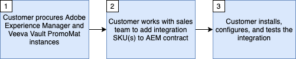

# Erste Schritte mit der Integration von Veeva Vault PromoMats und Adobe Experience Manager

Diese Integration verwaltet Ihre Inhalte, erzwingt Rechte und Compliance und nutzt gleichzeitig erstklassige Erlebnisbereitstellung.

Für diese Integration sind mindestens die folgenden Softwareversionen erforderlich:

* Adobe Experience Manager, 6.5.5+
* Veeva Vault PromoMats, 20R3.2+

>[!NOTE]
>
>Service-Benutzer und entsprechende Berechtigungen sind in beiden Systemen für die Integration erforderlich.
>

>[!IMPORTANT]
>
>Diese Funktion ist nicht standardmäßig als Teil des Produkts verfügbar. Die Implementierung erfordert einen Adobe Consulting-Wartungsvertrag. Wenden Sie sich an Ihren Adobe-Support-Mitarbeiter, um mehr zu erfahren.
>

## Grundsätze und Funktionen

Diese Integration unterstützt zwei Hauptanwendungsfälle:

1. Inhaltsvalidierung - Wenn neue Inhalte erstellt oder vorhandene Inhalte in AEM bearbeitet wurden, müssen die Inhalte für die Verwendung im VPM genehmigt werden, das den Genehmigungsprozess für medizinische, rechtliche und regulatorische (MLR) für Biowissenschaften unterstützt.
1. Content-Management - Bieten Sie Sichtbarkeit der Asset-Nutzung, indem Sie in PromoMats Beziehungen zwischen digitalen Taktiken (z. B. E-Mail, Präsentationen, Websites) und ihren Elementen (z. B. Logos, Fotografien, Grafiken) herstellen, die in AEM für Dokumente mit Ursprung in AEM erstellt wurden.

Zu den Vorteilen gehören:

* Beibehaltung einer zentralen Datenquelle für Assets und Inhalte ohne Duplizierung in allen digitalen Repositorys.
* Nutzung von Veeva Vault für Rechte- und Compliance-Management und AEM für optimale Asset- und Inhaltserstellung/-bereitstellung.
* Ermöglicht die Automatisierung des Verschiebens von Inhalten und Metadaten zwischen AEM und Veeva Vault.
* Reduziert den manuellen Aufwand beim Senden von Inhalten zur Genehmigung von Workflows an Veeva.
* Jedes System wird aufgrund seiner Stärken verwendet, und der Connector hilft beim automatischen Verschieben von Inhalten zwischen den Systemen, um die Markteinführungszeit zu beschleunigen.

Was bewirkt die Integration?

* Unterstützt das Senden von AEM-Site-Seiten, Assets, Inhaltsfragmenten und Experience Fragments an VPM. AEM-Seiten, Inhaltsfragmente und Experience Fragments können als Screenshot-PDF oder -Bilder gesendet werden. AEM Assets-Binärdateien werden unverändert gesendet.
* Unterstützt die manuelle und automatisierte Synchronisierung ausgewählter Metadatenelemente, die von AEM zu VPM konfigurierbar sind.
* Unterstützt die manuelle und automatisierte Synchronisierung ausgewählter Metadatenelemente, die von VPM zu AEM konfigurierbar sind.
* Unterstützt Beziehungen zwischen AEM-Site-Seiten, Assets, Inhaltsfragmenten und Experience Fragments in VPM, um Inhaltsbeziehungen zu automatisieren.
* Unterstützt die Generierung von Ausgabedarstellungen für mehrere Gerätetypen.

>[!NOTE]
>
>Weitere Informationen zu Konfigurationsoptionen finden Sie in der Dokumentation zur Integrationsnutzung .
>

Was tut der Connector NICHT?

* Repliziert keine AEM-Prozesse und -Funktionen in Veeva oder umgekehrt.
* Macht MLR nicht von selbst. Es hilft bei der Automatisierung des Versands von Inhalten an Veeva, wo MLR geschieht.
* Darf nicht verwendet werden, um ein identisches Setup zwischen AEM und Veeva zu erstellen. Nicht alle Inhalte müssen zwischen den beiden Plattformen verschoben werden.

>[!IMPORTANT]
>
>Diese Integration betrachtet AEM derzeit als die wahre Quelle für die Inhaltssynchronisierung.

## Integration abrufen

Um diese Integration bereitzustellen, müssen Sie die folgenden Schritte ausführen.

Bitte folgen Sie den unten stehenden Details zum Flussdiagramm und Flussdiagramm, um die Integration anzufordern und zu konfigurieren.

Flussdiagramm-Details (den oben genannten Schritten zugeordnet):

* **Schritt 1** - Es wird davon ausgegangen, dass Sie bereits eine Lizenz für Veeva Vault PromoMats und für Adobe Experience Manager haben oder gerade erwerben.
* **Schritt 2** - Ein neuer Kundenauftrag (SO), der einen Wartungsvertrag mit Adobe Consulting enthält, muss unterzeichnet werden, um die Integration nutzen zu können.
* **Schritt 3** - Installieren, Aktivieren und Konfigurieren des Integrationspakets.

## Support

Im Folgenden wird beschrieben, wie Sie Kontakt mit dem Support-Team aufnehmen und ein Problem protokollieren können.

### Integration oder Adobe Experience Manager-Support anfordern

Support-Tickets können bei der Adobe-Kundenunterstützung protokolliert werden. Ihr Adobe Experience Cloud-Administrator muss sich bei [Adobe Admin Console](https://adminconsole.adobe.com/) anmelden, auf die Registerkarte „Support“ klicken und einen Fall erstellen. Bei Problemen mit der -Integration sollten Sie die folgenden Informationen angeben:

* **Prozesstitel**: `AEM - Veeva Vault Integration`
* **Prozesseigentümer**: `Data Engineering`
* **Beschreibung**: `Description of the issue`
* **Ansprechpartner**: `The email address(es) for relavant AEM point of contacts for your organization.`
* **AEM-Instanz-URL**: `Place the Adobe Experience Manager instance url here.`
* **Veeva-Instanz-URL**: `Place the Veeva Vault PromoMats instance url here.`

### Veeva Vault PromoMats-Support anfordern

Manchmal ist das Problem, das beim Betrieb der Veeva Vault PromoMats-Instanz auftritt, ein Problem. In diesem Fall wird Ihr Administrator von Veeva Vault PromoMats möglicherweise aufgefordert, ein Support-Ticket bei „Veeva Support[ zu ](http://support.veeva.com/). Der Status der Veeva-Instanz kann durch Navigieren zu [Veeva Trust](http://trust.veeva.com/) angezeigt werden.

