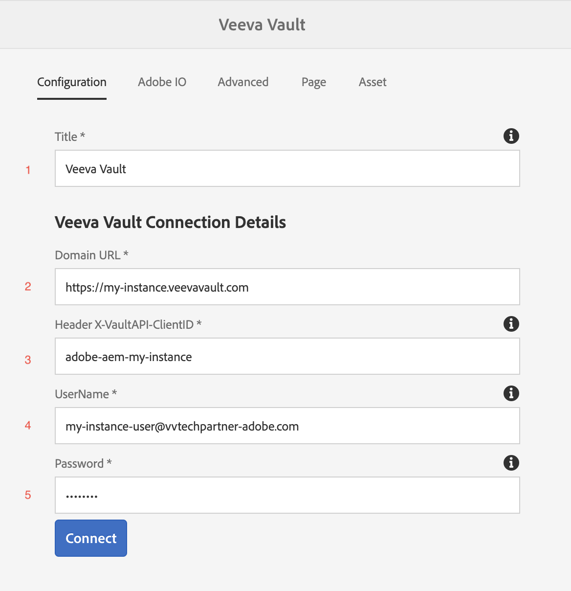

# Nutzung der Integration

## Anleitung

In der folgenden Videoanleitung wird die Verwendung des -Connectors beschrieben:

>[!VIDEO](https://video.tv.adobe.com/v/332137/?quality=12&learn=on)

## Einrichtung

Diese Anleitung führt Sie durch die Einrichtung und Ausführung des Connectors.

>[!IMPORTANT]
>
>Für jedes System müssen diese Schritte von einem **Administrator** für jedes System ausgeführt werden.
>
>Die Schritte in dieser Dokumentation führen Sie durch die Erstellung von Integrationen/Registrierungen, die die Zuweisung von Berechtigungen und/oder Administratorzugriff erfordern.  Es liegt in Ihrer Verantwortung, vor der Ausführung sicherzustellen, dass diese Schritte den Richtlinien Ihres Unternehmens entsprechen, und sie sorgfältig durchzuführen.
>

### Integrationspaket installieren

Sie erhalten Zugriff auf das Integrations-AEM-Paket. Es gibt zwei Möglichkeiten, die Integration zu installieren:

1. **Paketinstallation** - einfach und weniger aufwändig.
2. **POM-Installation** - Erweiterter, kann aber bei der Verwendung von AEM Cloud Manager und beim Upgrade der Integration nützlich sein.

#### Package-Installation

Um das Paket zu installieren, laden Sie es mit dem Link in der Onboarding-E-Mail herunter. [Detaillierte Anweisungen zum Installieren eines AEM-Pakets finden Sie hier.](https://experienceleague.adobe.com/docs/experience-manager-64/administering/contentmanagement/package-manager.html?#installing-packages)

#### POM-Installation

Gehen Sie wie folgt vor, um den Connector in Ihr POM aufzunehmen. Ersetzen Sie Ihren Benutzernamen und Ihr Kennwort durch die in der Onboarding-E-Mail erhaltenen.

1. Fügen Sie der `.cloudmanager/maven/settings.xml`-Datei in Ihrem Projekt oder `~/.m2/settings.xml` auf Ihrem Computer Folgendes hinzu. Ersetzen Sie `YOUR_USERNAME` durch den Benutzernamen und `YOUR_PASSWORD` mit dem Kennwort, das in der Onboarding-E-Mail angegeben ist.

   >[!IMPORTANT]
   >
   >Wenn Sie Cloud Manager verwenden, besteht der sichere Ansatz darin, die hier für kennwortgeschützte Maven[Repositorys beschriebenen Schritte ](https://experienceleague.adobe.com/docs/experience-manager-cloud-service/onboarding/getting-access/create-application-project/setting-up-project.html?lang=en#password-protected-maven-repositories).
   >

   ```
   <settings>
       ...
       <servers>
           ...
           <server>
               <id>repo.ea.adobe.net</id>
               <username>YOUR_USERNAME</username>
               <password>YOUR_PASSWORD</password>
               <filePermissions>BucketOwnerFullControl</filePermissions>
               <configuration>
                 <wagonProvider>s3</wagonProvider>
               </configuration>
           </server>
           ...
       </servers>
       ...
   </settings>
   ```

2. Fügen Sie der `pom.xml` des Projekts Folgendes hinzu:

   ```
   <project>
       ...
       <build>
           ...
           <extensions>
               ...
               <extension>
                   <groupId>com.allogy.maven.wagon</groupId>
                   <artifactId>maven-s3-wagon</artifactId>
                   <version>1.2.0</version>
               </extension>
               ...
           </extensions>
           ...
       </build>
       ...
       <repositories>
           ...
           <repository>
               <id>repo.ea.adobe.net</id>
               <url>s3://repo.ea.adobe.net/release</url>
               <releases>
                   <enabled>true</enabled>
               </releases>
           </repository>
           ...
       </repositories>
       ...
   </project>
   ```

3. Fügen Sie der `all/pom.xml` des Projekts Folgendes hinzu. Ersetzen Sie `project.dependencies.dependency.version` durch die entsprechende Version und `project.build.plugins.plugin.configuration.embeddeds.embedded.target` Sie durch den richtigen Pfad.

   ```
   <project>
       ...
       <build>
           ...
           <plugins>
               ...
               <plugin>
                   <groupId>org.apache.jackrabbit</groupId>
                   <artifactId>filevault-package-maven-plugin</artifactId>
                   ...
                   <configuration>
                       ...
                       <embeddeds>
                           ...
                           <embedded>
                               <groupId>com.adobe.acs.aemveeva</groupId>
                               <artifactId>aem-veeva-connector.all</artifactId>
                               <type>zip</type>
                               <target>/apps/APP_NAME-packages/application/install</target>
                           </embedded>
                           ...
                       </embeddeds>
                   </configuration>
               </plugin>
               ...
           </plugins>
           ...
       </build>
       ...
       <dependencies>
           ...
           <dependency>
               <groupId>com.adobe.acs.aemveeva</groupId>
               <artifactId>aem-veeva-connector.all</artifactId>
               <version>1.0.5</version>
               <type>zip</type>
           </dependency>            
           ...
       </dependencies>
       ...
   </project>
   ```

### Cloud-Konfiguration

Diese Integration wird durch Erstellen eines Cloud-Konfigurationsordners konfiguriert, in dem der Connector ausgeführt werden soll. Führen Sie die folgenden Schritte aus, um eine Cloud-Konfiguration zu erstellen:

1. Navigieren Sie zur Veeva-Cloud-Konfiguration.

   

2. Erstellen Sie eine neue Veeva-Cloud-Konfiguration im entsprechenden Ordner und füllen Sie die wie in den nächsten Abschnitten beschrieben.

   

#### Registerkarte „Konfiguration“

Füllen Sie auf der Registerkarte Konfiguration Folgendes aus:



1. Erforderlich. Titel der Connector-Konfiguration für Veeva Vault. Dies kann ein beliebiger Wert sein. (z. B. `Veeva Vault Configuration`)
2. Erforderlich. Die Domain-URL der Veeva-Instanz (z. B. `https://my-instance.veevavault.com/`)
3. Erforderlich. ClientID zum Aufrufen der Veeva Vault-API erforderlich. Dies kann ein beliebiger Wert sein und wird hauptsächlich zum Debugging verwendet. (z. B. `adobe-aem-vvtechpartner`)
4. Erforderlich. Veeva Vault-Benutzername. Siehe [Veeva-Benutzererstellung](#veeva-user-creation).
5. Erforderlich. Veeva Vault-Kennwort. Siehe [Veeva-Benutzererstellung](#veeva-user-creation).

#### Registerkarte Adobe IO

Wenn das Projekt PDF oder Bilder für -Seiten generieren muss, ist diese Registerkarte erforderlich. Füllen Sie Folgendes auf der Registerkarte „Adobe IO“ aus:

Registerkarte 

1. Erforderlich. Der Adobe IO-Endpunkt für die Erstellung von PDF-Images, der in der Onboarding-E-Mail bereitgestellt wurde. (z. B. `https://my-namespace.adobeioruntime.net/api/v1/web/aem-veeva-serverless-0.0.2/trigger-action.json`)
2. Erforderlich. Der Aktionsname für die Erstellung des Seitenbilds. Dieser Wert muss `aem-veeva-integration/get-image-async` sein.
3. Erforderlich. Der Aktionsname für die Erstellung von HTML-Bildern. Dieser Wert muss `aem-veeva-integration/get-pdf-async-new` sein.
4. Erforderlich. Der Adobe-IO-Endpunkt , um den Status der Generierung abzurufen, die in der Onboarding-E-Mail bereitgestellt wurde.(z. B. `https://my-namespace.adobeioruntime.net/api/v1/web/aem-veeva-serverless-0.0.2/get-state-value`)
5. Erforderlich. AEM-Benutzername, der von Adobe-IO verwendet wird. Siehe [AEM-Benutzererstellung](#aem-user-creation).
6. Erforderlich. AEM-Kennwort, das von Adobe IO verwendet wird. Siehe [AEM-Benutzererstellung](#aem-user-creation).
7. Optional. Die standardmäßige Zeitüberschreitung besteht darin, die Seite bis zu einem bestimmten Zeitpunkt reagieren zu lassen, nach dem der AIO-Service keine Antwort mehr abrufen möchte. Der Standardwert ist `30000`.
8. Optional. Verzögerung ist, nachdem die Seite mit 200 geantwortet hat, damit sich das Rendern aller Bilder verzögert, bevor ein Screenshot erstellt wird. Der Standardwert ist `2000`.
9. Optional. Die von Screenshot/PDF generierte URL ist nach dem konfigurierten Wert in Sekunden abgelaufen.
10. Optional. Adobe-IO-Screenshot-/PDF-Generierungsdienst ist asynchron. AEM-Dienst ruft AIO-Statusendpunkt auf, um Screenshot/PDF zu erhalten. Diese Eigenschaft entscheidet in Millisekunden, zwischen welchen Pausen bei jedem Statusaufruf gewechselt wird. Der Standardwert ist `10000`.
11. Optional. Maximale Wiederholungsanzahl für Statusaufrufe an Adobe-IO zum Abrufen von Screenshot/PDF. Der Standardwert ist `10`.

#### Registerkarte Erweitert

Füllen Sie auf der Registerkarte Erweitert Folgendes aus:


1. Erforderlich für die PDF-/Bildgenerierung. Das beim Erstellen von PDF/Bildern verwendete Dateinamenmuster. `{name}` können als Vorlage verwendet werden. (z. B. `{name}-screenshot`)
2. Optional. Die Gerätetypen, für die Seiten-Screenshots außer Desktop erforderlich sind. Gültige Typen sind `Tab (iPad)` und `Mobile (iPhone X)`.
3. Optional. Der Wert für den Ausgabedarstellungstyp in Veeva, der die obige Ausgabedarstellung darstellt. (z. B. `web_ready__c`)
4. Erforderlich für die PDF-/Bildgenerierung. Typ des zu erstellenden Screenshots Entweder `PDF` oder `Image`
5. Erforderlich für die PDF-/Bildgenerierung. Der zu erzeugende PDF-Typ. Entweder `Print CSS Based PDF` oder `Pixel Perfect Screenshot PDF`
6. Erforderlich für die PDF-/Bildgenerierung. Der zu erzeugende Bildtyp. Entweder `PNG` oder `JPEG`
7. Erforderlich. Workflow, der ausgeführt werden soll, sobald der Veeva-Vault-Genehmigungs-Trigger durchlaufen wurde.
8. Erforderlich. Wert der Statuseigenschaft, der „Genehmigt“ darstellt. (z. B. `Approved for Distribution`)
9. Erforderlich. Workflow, der ausgeführt werden soll, sobald der Veeva-Vault-Ablehnungs-Trigger durchgekommen ist.
10. Erforderlich. Wert der Statuseigenschaft, der „Abgelehnt/Nicht genehmigt“ darstellt. (z. B. `Rejected`)
11. Optional. Eigenschaftsname für Dokument-ID in Veeva Vault. Der Standardwert ist `id`.
12. Optional. Eigenschaftsname für Status in Veeva Vault. Der Standardwert ist `status__v`.
13. Optional. Eigenschaftsname für Änderungsdatum des Dokuments Der Standardwert ist `version_modified_date__v`.
14. Optional. Eigenschaftsname für Dokumentressourcen-URL. Der Standardwert wird `external_id__v`. Wenn dieses Feld bereits verwendet wird, erstellen Sie ein anderes Feld in Veeva und füllen Sie den Feldnamen hier aus. Dieses Feld wird in Veeva verwendet, um den AEM-Ressourcenpfad zu speichern. Dies ist für die automatisierte Metadaten-Synchronisierung erforderlich.
15. Optional. Eigenschaftsname für die Hauptversionsnummer in Veeva Vault. Der Standardwert ist `major_version_number__v`.
16. Optional. Eigenschaftsname für die Nebenversionsnummer in Veeva Vault. Der Standardwert ist `minor_version_number__v`.
17. Optional. Veeva Vault-Beziehungstyp-Wert. Alle zu dieser Seite hinzugefügten Assets werden auf Grundlage dieses Werts als verwandt dargestellt. Der Standardwert ist `supporting_document__c`.

#### Registerkarte „Seite“

Wenn Sie Seiten synchronisieren, füllen Sie Folgendes auf der Registerkarte Seite aus:


1. Erforderlich. Ordnen Sie eine Eigenschaft von AEM nach Veeva zu.
A. AEM-Eigenschaftsname. Aus AEM-Eigenschaften auswählbar. (z. B. `jcr:title`) `{name}` können als Vorlage verwendet werden.
b. Veeva Eigenschaftsname, der genau unter eingegeben wurde, existiert in Veeva. (z. B. `name__v`)\
   c. Eigenschaftstyp. Entweder `Text` oder `Multiline Text`

2. Erforderlich. Zuordnen einer Eigenschaft von Veeva zu AEM.
a. Der unter genau eingegebene Veeva-Eigenschaftsname existiert in Veeva. (z. B. `name__v`)
B. AEM-Eigenschaftsname. Aus AEM-Eigenschaften auswählbar. (z. B. `jcr:title`)
c. Eigenschaftstyp. Entweder `Text` oder `Multiline Text`


#### Registerkarte „Asset“

Wenn Sie Assets synchronisieren, füllen Sie Folgendes auf der Registerkarte Asset aus:


1. Erforderlich. Ordnen Sie eine Eigenschaft von AEM nach Veeva zu.
A. AEM-Eigenschaftsname. Aus AEM-Eigenschaften auswählbar. (z. B. `/jcr:content/metadata/jcr:title`) `{name}` können als Vorlage verwendet werden.
b. Veeva Eigenschaftsname, der genau unter eingegeben wurde, existiert in Veeva. (z. B. `name__v`)
c. Eigenschaftstyp. Entweder `Text` oder `Multiline Text`

2. Erforderlich. Zuordnen einer Eigenschaft von Veeva zu AEM.
a. Der unter genau eingegebene Veeva-Eigenschaftsname existiert in Veeva. (z. B. `name__v`)
B. AEM-Eigenschaftsname. Aus AEM-Eigenschaften auswählbar. (z. B. `/jcr:content/metadata/jcr:title`)
c. Eigenschaftstyp. Entweder `Text` oder `Multiline Text`

### Zusätzliche Einrichtung

#### AEM-Benutzererstellung

Während der PDF-/Bildgenerierung muss ein AEM-Benutzer erstellt werden, um Seiten von AEM zu erhalten. Erstellen Sie schreibgeschützte Berechtigungen für einen Benutzer, indem Sie die folgenden Links aufrufen:

Bei Verwendung von AEM 6.5.5+:

* [Erstellen eines Benutzers in AEM](https://experienceleague.adobe.com/docs/experience-manager-65/forms/administrator-help/setup-organize-users/adding-configuring-users.html?#create-a-user)
* [Hinzufügen von Berechtigungen zu einem Benutzer in AEM](https://experienceleague.adobe.com/docs/experience-manager-65/administering/security/security.html?#permissions-in-aem)

Bei Verwendung von AEM-Cloud Services:

* [Verwalten von Benutzenden mit AEM-Cloud Services ](https://experienceleague.adobe.com/docs/experience-manager-learn/cloud-service/accessing/aem-users-groups-and-permissions.html?#accessing)

Die folgenden Berechtigungen sind für den AEM-Service-Benutzer für den Inhalt erforderlich, der in PDF/Image konvertiert und an Veeva gesendet wird:

* Lesen

>[!IMPORTANT]
>
> Diese Aktionen müssen für jedes System als Administrator ausgeführt werden.
> Beim Erstellen von Benutzern und Festlegen von Berechtigungen müssen Sie die Sicherheitsstandards Ihrer Organisation einhalten.
>

#### Veeva-Benutzererstellung

Um diese Integration verwenden zu können, muss ein Benutzer in Veeva Vault erstellt werden. Gehen Sie wie folgt vor, um einen Benutzer zu erstellen:

1. Navigieren Sie zu Admin > Benutzer und Gruppen > Vault-Benutzer > Erstellen .

   

2. Füllen Sie die erforderlichen Eingaben aus. Die einfachste Einrichtung besteht darin, die `License Type` auf `Full User` und die `Security Profile` auf `Vault Owner` festzulegen. Nach Abschluss speichern.

   

Die folgenden Berechtigungen sind für die spezifischen Veeva-Dokumenttypen erforderlich, die verwendet werden:

* Dokumente erstellen/lesen
* Erstellen/Lesen von Versionen
* Erstellen/Aktualisieren von Metadaten
* Erstellen/Aktualisieren von Ausgabedarstellungen

>[!IMPORTANT]
>
> Diese Aktionen müssen für jedes System als Administrator ausgeführt werden.
> Beim Erstellen von Benutzern und Festlegen von Berechtigungen müssen Sie die Sicherheitsstandards Ihrer Organisation einhalten.
>
