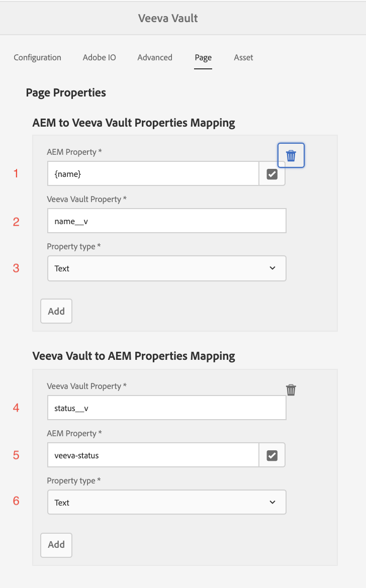

# Nutzung der Integration

## Exemplarische Vorgehensweise

Im folgenden Video-Beispiel wird die Verwendung des Connectors beschrieben:

>[!VIDEO](https://video.tv.adobe.com/v/332137/?quality=12&learn=on)

## Einrichtung

Dieser Leitfaden führt Sie durch die Einrichtung und Ausführung des Connectors.

>[!IMPORTANT]
>
>Für jedes System müssen diese Schritte von einem **Administrator** für jedes System ausgeführt werden.
>
>Die Schritte in dieser Dokumentation führen Sie durch das Erstellen von Integrationen/Registrierungen, bei denen Berechtigungen und/oder Administratorzugriff zugewiesen werden müssen.  Es liegt in Ihrer Verantwortung, sicherzustellen, dass diese Schritte Ihren Unternehmensrichtlinien entsprechen, bevor Sie sie durchführen, und sie sorgfältig durchzuführen.
>

### Integrationspaket installieren

Sie erhalten Zugriff auf das Integrations-AEM-Package. Es gibt zwei Optionen zur Installation der Integration:

1. **Paketinstallation** - Direkt nach vorne und weniger beteiligt.
2. **POM-Installation** - Erweiterte Funktionen, die jedoch bei der Verwendung von AEM Cloud Manager und der Aktualisierung der Integration nützlich sein können.

#### Paketinstallation

Um das Paket zu installieren, laden Sie es mit dem in der Onboarding-E-Mail angegebenen Link herunter. [Detaillierte Anweisungen zum Installieren eines AEM-Packages finden Sie hier.](https://experienceleague.adobe.com/docs/experience-manager-64/administering/contentmanagement/package-manager.html?#installing-packages)

#### POM-Installation

Gehen Sie wie folgt vor, um den Connector in Ihr POM aufzunehmen. Ersetzen Sie Ihren Benutzernamen und Ihr Passwort durch die in der Onboarding-E-Mail erhaltenen.

1. Fügen Sie Folgendes zur Datei `.cloudmanager/maven/settings.xml` in Ihrem Projekt oder `~/.m2/settings.xml` auf Ihrem Computer hinzu. Ersetzen Sie `YOUR_USERNAME` durch den Benutzernamen und `YOUR_PASSWORD` durch das in der Onboarding-E-Mail angegebene Passwort.

   >[!IMPORTANT]
   >
   >Bei Verwendung von Cloud Manager besteht der sichere Ansatz darin, die hier für [kennwortgeschützte Maven-Repositorys](https://experienceleague.adobe.com/docs/experience-manager-cloud-service/onboarding/getting-access/create-application-project/setting-up-project.html?lang=en#password-protected-maven-repositories) beschriebenen Schritte durchzuführen.
   >

   ```
   <settings>
       ...
       <servers>
           ...
           <server>
               <id>repo.ea.adobe.net</id>
               <username>YOUR_USERNAME</username>
               <password>YOUR_PASSWORD</password>
               <filePermissions>BucketOwnerFullControl</filePermissions>
               <configuration>
                 <wagonProvider>s3</wagonProvider>
               </configuration>
           </server>
           ...
       </servers>
       ...
   </settings>
   ```

2. Fügen Sie der Datei &quot;`pom.xml`&quot;des Projekts Folgendes hinzu:

   ```
   <project>
       ...
       <build>
           ...
           <extensions>
               ...
               <extension>
                   <groupId>com.allogy.maven.wagon</groupId>
                   <artifactId>maven-s3-wagon</artifactId>
                   <version>1.2.0</version>
               </extension>
               ...
           </extensions>
           ...
       </build>
       ...
       <repositories>
           ...
           <repository>
               <id>repo.ea.adobe.net</id>
               <url>s3://repo.ea.adobe.net/release</url>
               <releases>
                   <enabled>true</enabled>
               </releases>
           </repository>
           ...
       </repositories>
       ...
   </project>
   ```

3. Fügen Sie der Datei &quot;`all/pom.xml`&quot;des Projekts Folgendes hinzu. Ersetzen Sie `project.dependencies.dependency.version` durch die entsprechende Version und `project.build.plugins.plugin.configuration.embeddeds.embedded.target` durch den richtigen Pfad.

   ```
   <project>
       ...
       <build>
           ...
           <plugins>
               ...
               <plugin>
                   <groupId>org.apache.jackrabbit</groupId>
                   <artifactId>filevault-package-maven-plugin</artifactId>
                   ...
                   <configuration>
                       ...
                       <embeddeds>
                           ...
                           <embedded>
                               <groupId>com.adobe.acs.aemveeva</groupId>
                               <artifactId>aem-veeva-connector.all</artifactId>
                               <type>zip</type>
                               <target>/apps/APP_NAME-packages/application/install</target>
                           </embedded>
                           ...
                       </embeddeds>
                   </configuration>
               </plugin>
               ...
           </plugins>
           ...
       </build>
       ...
       <dependencies>
           ...
           <dependency>
               <groupId>com.adobe.acs.aemveeva</groupId>
               <artifactId>aem-veeva-connector.all</artifactId>
               <version>1.0.5</version>
               <type>zip</type>
           </dependency>            
           ...
       </dependencies>
       ...
   </project>
   ```

### Cloud-Konfiguration

Diese Integration wird konfiguriert, indem eine Cloud-Konfiguration für den Ordner erstellt wird, in dem der Connector ausgeführt wird. Führen Sie die folgenden Schritte aus, um eine Cloud-Konfiguration zu erstellen:

1. Navigieren Sie zur Konfiguration der Veeva-Cloud .

   

2. Erstellen Sie eine neue Veeva-Cloud-Konfiguration für den entsprechenden Ordner und füllen Sie die wie in den nächsten Abschnitten beschrieben aus.

   

#### Registerkarte „Konfiguration“

Füllen Sie im Konfigurationstab Folgendes aus:


1. Erforderlich. Titel für die Konfiguration des Veva Vault-Connectors. Dies kann ein beliebiger Wert sein. (z. B. `Veeva Vault Configuration`)
2. Erforderlich. Die Domain-URL der VEE-Instanz (z. B. `https://my-instance.veevavault.com/`)
3. Erforderlich. ClientID erforderlich, um Veeva Vault API aufzurufen. Dies kann ein beliebiger Wert sein und wird hauptsächlich zum Debugging verwendet. (z. B. `adobe-aem-vvtechpartner`)
4. Erforderlich. Veva Vault-Benutzername. Siehe [Veeva-Benutzererstellung](#veeva-user-creation).
5. Erforderlich. Veva Vault-Kennwort. Siehe [Veeva-Benutzererstellung](#veeva-user-creation).

#### Registerkarte &quot;Adobe IO&quot;

Wenn das Projekt PDF oder Bilder für Seiten generieren muss, ist diese Registerkarte erforderlich. Füllen Sie auf der Registerkarte &quot;adobe io&quot;Folgendes aus:


1. Erforderlich. Der Adobe IO-Endpunkt zum Erstellen von PDF-Bildern, der in der Onboarding-E-Mail bereitgestellt wurde. (z. B. `https://my-namespace.adobeioruntime.net/api/v1/web/aem-veeva-serverless-0.0.2/trigger-action.json`)
2. Erforderlich. Der Aktionsname für die Generierung von Seitenbildern. Dieser Wert muss `aem-veeva-integration/get-image-async` sein.
3. Erforderlich. Der Aktionsname für die HTML-Bildgenerierung. Dieser Wert muss `aem-veeva-integration/get-pdf-async-new` sein.
4. Erforderlich. Der Adobe IO-Endpunkt zum Abrufen des Status der in der Onboarding-E-Mail bereitgestellten Generierung.(z. B. `https://my-namespace.adobeioruntime.net/api/v1/web/aem-veeva-serverless-0.0.2/get-state-value`)
5. Erforderlich. AEM Benutzername, der von Adobe IO verwendet werden soll. Siehe [AEM Benutzererstellung](#aem-user-creation).
6. Erforderlich. AEM Passwort, das von Adobe IO verwendet werden soll. Siehe [AEM Benutzererstellung](#aem-user-creation).
7. Optional. Der Standardwert für die Zeitüberschreitung besteht darin, dass die Seite bis zu einem bestimmten Zeitpunkt antworten kann, nach dem der AIO-Dienst aufhört, eine Antwort zu erhalten. Der Standardwert ist `30000`.
8. Optional. Die Verzögerung liegt vor, nachdem die Seite mit 200 reagiert hat, um die Wiedergabe aller Bilder zu verzögern, bevor ein Screenshot erstellt wird. Der Standardwert ist `2000`.
9. Optional. Die von Screenshot/PDF generierte URL läuft nach dem konfigurierten Wert in Sekunden ab.
10. Optional. Adobe IO Screenshot/PDF-Generierungsdienst ist asynchron. AEM Dienst ruft den AIO-Statusendpunkt auf, um Screenshot/PDF zu erhalten. Diese Eigenschaft entscheidet in Millisekunden über die Pause zwischen den einzelnen Statusaufrufen. Der Standardwert ist `10000`.
11. Optional. Maximale Wiederholungsanzahl für Statusaufrufe an Adobe IO zum Abrufen von Screenshots/PDF. Der Standardwert ist `10`.

#### Erweiterte Registerkarte

Füllen Sie auf der Registerkarte Erweitert Folgendes aus:


1. Erforderlich für PDF/Bildgenerierung. Das beim Erstellen von PDF/Bildern verwendete Dateinamenmuster. `{name}` kann als Vorlage verwendet werden. (z. B. `{name}-screenshot`)
2. Optional. Die Gerätetypen, für die andere Screenshots als Desktop erforderlich sind. Gültige Typen sind `Tab (iPad)` und `Mobile (iPhone X)`.
3. Optional. Der Wert des Ausgabetyps in Veeva, der die oben dargestellte Ausgabedarstellung darstellt. (z. B. `web_ready__c`)
4. Erforderlich für PDF/Bildgenerierung. Zu erstellender Screenshot-Typ. Entweder `PDF` oder `Image`.
5. Erforderlich für PDF/Bildgenerierung. Der zu generierende PDF-Typ. Entweder `Print CSS Based PDF` oder `Pixel Perfect Screenshot PDF`.
6. Erforderlich für PDF/Bildgenerierung. Der zu generierende Bildtyp. Entweder `PNG` oder `JPEG`.
7. Erforderlich. Workflow, der ausgeführt wird, sobald der Veeva Vault Approval Trigger durchlaufen wurde.
8. Erforderlich. Statuseigenschaftswert, der Genehmigt darstellt. (z. B. `Approved for Distribution`)
9. Erforderlich. Workflow wird ausgeführt, sobald der Trigger Veeva Vault Reject durchlaufen wurde.
10. Erforderlich. Status-Eigenschaftswert, der Abgelehnt/Nicht genehmigt darstellt. (z. B. `Rejected`)
11. Optional. Eigenschaftsname für Dokument-ID in Veeva Vault. Der Standardwert ist `id`.
12. Optional. Eigenschaftsname für den Status in Veeva Vault. Der Standardwert ist `status__v`.
13. Optional. Eigenschaftsname für &quot;Dokument geändert&quot;-Datum. Der Standardwert ist `version_modified_date__v`.
14. Optional. Eigenschaftsname für URL der Dokumentressource Der Standardwert ist `external_id__v`. Wenn dieses Feld bereits verwendet wird, erstellen Sie ein anderes Feld in Veeva und geben Sie hier den Feldnamen ein. Dieses Feld wird in Veeva verwendet, um den AEM Ressourcenpfad zu speichern. Dies ist für die automatisierte Metadaten-Synchronisierung erforderlich.
15. Optional. Eigenschaftsname für die Hauptversionsnummer in Veeva Vault. Der Standardwert ist `major_version_number__v`.
16. Optional. Eigenschaftsname für Nebenversionsnummer in Veeva Vault. Der Standardwert ist `minor_version_number__v`.
17. Optional. Veva Vault-Beziehungstypwert. Alle zu einer Seite hinzugefügten Assets werden anhand dieses Werts als verwandt dargestellt. Der Standardwert ist `supporting_document__c`.

#### Registerkarte &quot;Seite&quot;

Wenn Sie Seiten synchronisieren, füllen Sie auf der Registerkarte &quot;Seite&quot;Folgendes aus:



1. Erforderlich. Ordnen Sie eine Eigenschaft von AEM zu Veeva zu.
a. AEM Eigenschaftsname. Aus AEM Eigenschaften auswählen. (z. B. `jcr:title`) `{name}` kann als Vorlage verwendet werden.
b. Der genau unter eingegebene Name der Veeva-Eigenschaft ist in Veeva vorhanden. (z. B. `name__v`)\
   c. Eigenschaftstyp Entweder `Text` oder `Multiline Text`.

2. Erforderlich. Ordnen Sie eine Eigenschaft von Veeva AEM zu.
a. Der genau unter eingegebene Name der Veeva-Eigenschaft ist in Veeva vorhanden. (z. B. `name__v`)
b. AEM Eigenschaftsname. Aus AEM Eigenschaften auswählen. (z. B. `jcr:title`)
c. Eigenschaftstyp Entweder `Text` oder `Multiline Text`.


#### Registerkarte „Asset“

Wenn Sie Assets synchronisieren, füllen Sie auf der Registerkarte &quot;Asset&quot;Folgendes aus:


1. Erforderlich. Ordnen Sie eine Eigenschaft von AEM zu Veeva zu.
a. AEM Eigenschaftsname. Aus AEM Eigenschaften auswählen. (z. B. `/jcr:content/metadata/jcr:title`) `{name}` kann als Vorlage verwendet werden.
b. Der genau unter eingegebene Name der Veeva-Eigenschaft ist in Veeva vorhanden. (z. B. `name__v`)
c. Eigenschaftstyp Entweder `Text` oder `Multiline Text`.

2. Erforderlich. Ordnen Sie eine Eigenschaft von Veeva AEM zu.
a. Der genau unter eingegebene Name der Veeva-Eigenschaft ist in Veeva vorhanden. (z. B. `name__v`)
b. AEM Eigenschaftsname. Aus AEM Eigenschaften auswählen. (z. B. `/jcr:content/metadata/jcr:title`)
c. Eigenschaftstyp Entweder `Text` oder `Multiline Text`.

### Zusätzliche Einrichtung

#### AEM Benutzererstellung

Bei der PDF/Bildgenerierung muss ein AEM Benutzer erstellt werden, um Seiten von AEM zu erhalten. Erstellen Sie einen Benutzer und gewähren Sie ihm Leseberechtigungen, indem Sie die folgenden Links verwenden:

Bei Verwendung von AEM 6.5.5+:

* [Erstellen eines Benutzers in AEM](https://experienceleague.adobe.com/docs/experience-manager-65/forms/administrator-help/setup-organize-users/adding-configuring-users.html?#create-a-user)
* [Hinzufügen von Berechtigungen zu einem Benutzer in AEM](https://experienceleague.adobe.com/docs/experience-manager-65/administering/security/security.html?#permissions-in-aem)

Bei Verwendung von AEM Cloud Services:

* [Verwalten von Benutzern mit AEM Cloud Services](https://experienceleague.adobe.com/docs/experience-manager-learn/cloud-service/accessing/aem-users-groups-and-permissions.html?#accessing)

Die folgenden Berechtigungen sind für den Benutzer des AEM-Dienstes für den Inhalt erforderlich, der in PDF/Image konvertiert und an Veeva gesendet wird:

* Lesen

>[!IMPORTANT]
>
> Diese Aktionen müssen als Administrator für jedes System durchgeführt werden.
> Sie müssen beim Erstellen von Benutzern und Festlegen von Berechtigungen die Sicherheitsstandards Ihrer Organisation einhalten.
>

#### Veeva-Benutzererstellung

Um diese Integration verwenden zu können, muss ein Benutzer in Veeva Vault erstellt werden. Gehen Sie wie folgt vor, um einen Benutzer zu erstellen:

1. Navigieren Sie zu Admin > Benutzer und Gruppen > Vault-Benutzer > Erstellen

   

2. Füllen Sie die erforderlichen Eingaben aus. Die einfachste Einrichtung besteht darin, die `License Type` auf `Full User` und die `Security Profile` auf `Vault Owner` festzulegen. Speichern Sie nach Abschluss.

   

Die folgenden Berechtigungen sind für die jeweiligen verwendeten Veeva-Dokumenttypen erforderlich:

* Erstellen/Lesen von Dokumenten
* Versionen erstellen/lesen
* Erstellen/Aktualisieren von Metadaten
* Erstellen/Aktualisieren von Ausgabedarstellungen

>[!IMPORTANT]
>
> Diese Aktionen müssen als Administrator für jedes System durchgeführt werden.
> Sie müssen beim Erstellen von Benutzern und Festlegen von Berechtigungen die Sicherheitsstandards Ihrer Organisation einhalten.
>
